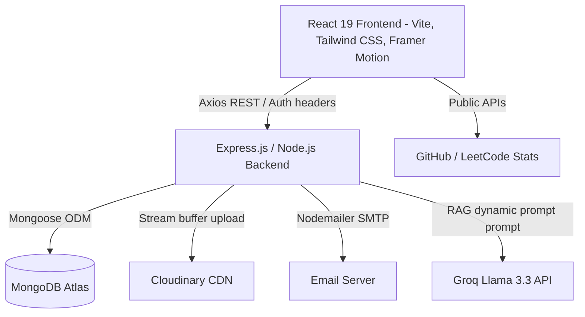
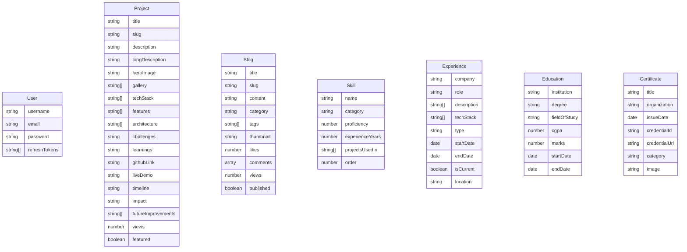
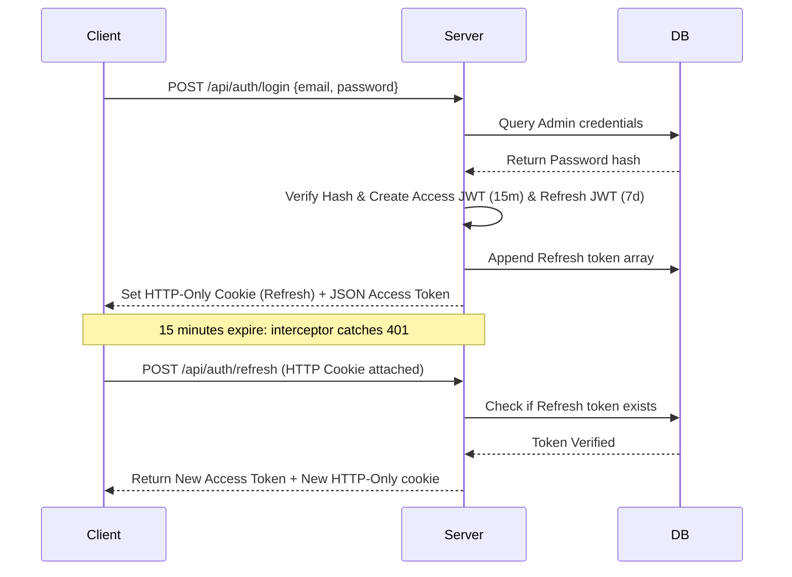

# Premium Full-Stack MERN Developer Portfolio Platform

Welcome to the production-ready, animated, scalable **MERN Portfolio Platform** built for Madanraj.

This is a premium SaaS-like application that showcases personal branding, technical skills, timelines, project case studies, and coding profiles, coupled with a retrieval-assisted **AI Co-Pilot Assistant** trained on the database portfolio contents.

---

## 1. System Architecture Diagram



---

## 2. Folder Structure Explanation

```
madanraj-portfolio/
├── package.json (Monorepo root configurations & scripts)
├── client/
│   ├── index.html (Root layout viewport & Google Fonts preloads)
│   ├── tailwind.config.js (Premium custom color systems, glow shadows, float animations)
│   ├── vite.config.js (Proxy configurations routing /api requests to server during dev)
│   └── src/
│       ├── main.jsx (Render entry, strict mode, SEO HelmetProvider, React Query clients)
│       ├── index.css (Custom scrollbars, background grids, aurora glows, cursors)
│       ├── context/ (ThemeContext dark/light systems & AuthContext secure session states)
│       ├── services/ (Axios configurations, JWT auth injectors & silent refresh interceptors)
│       ├── layouts/ (MainLayout template loading cursors, headers, footers & floating chatbot)
│       ├── components/
│       │   ├── layout/ (Responsive Header, Footer, CustomCursor, floating ChatBot)
│       │   ├── common/ (CommandPalette search dialog)
│       │   └── sections/ (Hero animations, about timeline, skills progress, case study card grids)
│       └── pages/ (Home compilation, case studies, blog details, cert lists, admin dashboard)
└── server/
    ├── server.js (Express server, secure cookie readers, static directories, global middleware)
    ├── config/ (Mongoose database connectors)
    ├── models/ (Mongoose validation schemas)
    ├── middlewares/ (JWT protectors, custom analytics trackers, rate limiters)
    ├── services/ (Nodemailer notifications, Cloudinary CDN connectors, Gemini AI engines)
    ├── controllers/ (CRUD routers implementation)
    └── routes/ (Prefix API compiles)
```

---

## 3. Database ER Diagram



---

## 4. Auth Session Sequence Diagram



---

## 5. REST API Documentation

### Authentication & Profiles
- `POST /api/auth/register` - Create primary admin account (disabled after first setup).
- `POST /api/auth/login` - Sign in admin, registers HTTP-Only refresh cookie & JSON token.
- `POST /api/auth/refresh` - Silent tokens refresher.
- `POST /api/auth/logout` - Revoke tokens and clear cookie keys.
- `GET /api/auth/me` - Query current active admin credentials.

### Case Studies & Resources
- `GET /api/projects` - List all projects (supports query searches `?search=react` or `?featured=true`).
- `GET /api/projects/slug/:slug` - Fetch case study details (increments views count).
- `POST /api/projects` - Add project (Admin, handles heroImage + gallery files).
- `PUT /api/projects/:id` - Update project details (Admin).
- `DELETE /api/projects/:id` - Remove project & clean CDN files (Admin).

### Interactive chatbot
- `POST /api/ai/chat` - Queries co-pilot using current database context (guarded with rate-limiters).

### Analytics
- `GET /api/analytics` - Pull traffic summaries, trends, and geo-IP distributions (Admin).
- `POST /api/analytics/event` - Log clicks/downloads events from client.

---

## 6. Installation & Local Setup

### System Prerequisites
- Node.js (v18 or higher)
- Local MongoDB or MongoDB Atlas credentials
- Optional: Groq API Key & Cloudinary variables

### Quickstart Setup
1. Clone / copy the portfolio workspace.
2. In the `server` directory, configure variables inside `.env`:
   ```env
   PORT=5000
   MONGODB_URI=mongodb+srv://...
   JWT_SECRET=yoursecrettokenkey
   JWT_REFRESH_SECRET=yoursecretrefreshtokenkey
   GROQ_API_KEY=your_groq_api_key
   ADMIN_EMAIL=your_email@gmail.com
   CLIENT_URL=http://localhost:5173
   ```
3. Run package installations at the root:
   ```bash
   npm install --legacy-peer-deps
   ```
4. Fire the local development servers:
   ```bash
   npm run dev
   ```
   The application will mount:
   - Frontend client: [http://localhost:5173](http://localhost:5173)
   - Express server API: [http://localhost:5000](http://localhost:5000)

---

## 7. Deployment Instructions

### Frontend (Vercel)
- Bind the repository to Vercel.
- Configure Framework Preset: **Vite**.
- Set Build Command: `npm run build` with Output Directory: `client/dist`.
- Point Server variables proxy to Vercel (or rewrite routing inside a `vercel.json` configurations file).

### Backend (Railway / Render)
- Set Environment variables corresponding to `.env`.
- Point the Root Directory to `server`.
- Run commands: `npm install` and start script: `node server.js`.

---

## 8. Future Improvements
- **PWA support**: Configure offline page caching policies.
- **Dynamic Coding widgets**: Hook live REST calls to LeetCode and GitHub contribution graphs directly inside profiles section.
- **Resume Version History**: Retain past CV documents inside MongoDB collections.
